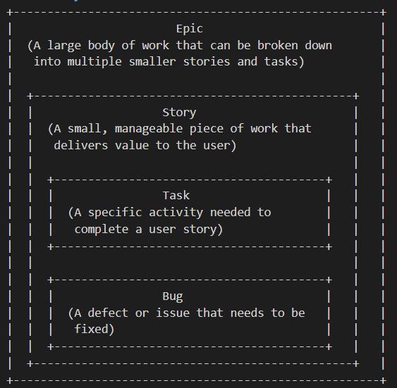

In Agile methodologies, particularly within frameworks like Scrum, work is broken down into various elements such as epics, stories, tasks, and bugs. These elements are used to manage and track the development process effectively.

1. **Epic**:
    - Definition: A large body of work that can be broken down into smaller, more manageable pieces called user stories.
    - Example: For an edutech platform, an epic might be "Implement User Management System."

2. **User Story**:  
    - Definition: A short, simple description of a feature from the perspective of the end-user or customer. User stories are derived from epics.
    - Example: Under the "Implement User Management System" epic, a user story could be "As an admin, I want to create user accounts so that new users can access the platform."

3. **Task**:
    - Definition: A specific piece of work required to implement a user story. Tasks are often technical and describe what needs to be done.
    - Example: For the user story "As an admin, I want to create user accounts," tasks might include:
        - "Design the user account creation form."
        - "Develop the backend API for account creation."
        - "Implement frontend validation for the form fields."
        - "Write unit tests for the account creation process."

4. **Bug**:
    - Definition: A defect or issue in the software that needs to be fixed. Bugs can be reported during development or after deployment.
    - Example: "The user creation form fails to validate email addresses correctly."

**Hierarchy**

