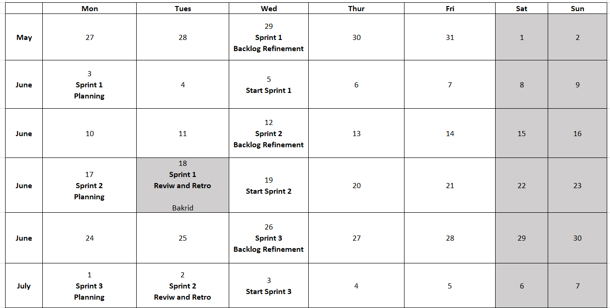

Agile methodologies, particularly Scrum, outline specific ceremonies (meetings) and roles to structure the workflow and ensure effective collaboration. 

### Agile Ceremonies
1. **Backlog Refinement (Grooming)**
    -   Purpose: Ensure the backlog remains populated with items that are relevant, detailed, and estimated to the degree necessary for sprint planning.

    - Participants: Product Owner, Scrum Master, Development Team.

    - Activities:
        - Review and prioritize the items in the backlog.
        - Break down large items into smaller, actionable tasks.
        - Add details and estimates to the backlog items.
        - The Product Owner provides more details and the team estimates the effort.
        - These refined items are then prioritized for future sprints.

    - Example: The team reviews the backlog and refines user stories related to adding new types of questions (e.g., multiple-choice, fill-in-the-blank) to the quiz module. They estimate the effort required and prioritize them for upcoming sprints.

2. **Sprint Planning**
    - Purpose: Define what will be delivered in the upcoming sprint and how the team will accomplish that work.
    
    - Participants: Product Owner, Scrum Master, Development Team.

    - Activities:
        - The Product Owner presents the highest priority items from the product backlog.
        - The Development Team selects items they can commit to completing.
        - The team breaks down selected items into tasks and estimates the effort required.

    - Example: An edutech company planning a two-week sprint to develop a new quiz module for their learning platform. The team 
    identifies and prioritizes tasks like designing the quiz UI, coding the backend logic, and creating question sets.

3. **Sprint Review/Demo**
    - Purpose: Inspect the outcome of the sprint and gather feedback from stakeholders.
    
    - Participants: Product Owner, Scrum Master, Development Team, Stakeholders.

    - Activities:
        - The team demonstrates the work completed during the sprint.
        - Stakeholders provide feedback.
        - Discussion on what was accomplished versus what was planned.
    
    - Example: The team demonstrates the new quiz module to teachers and students, who provide feedback on its usability and suggest additional features.

4. **Sprint Retrospective**
    - Purpose: Reflect on the past sprint and identify improvements for the future.

    - Participants: Scrum Master, Development Team.

    - Activities:
        - Discuss what went well, what didn’t, and how processes can be improved.
        - Identify actionable steps for improvement.

    - Example: The team discusses that communication could be improved, so they decide to use a new tool for better task tracking and set up more frequent check-ins.

5. **Daily Stand-up (Daily Scrum)**
    - Purpose: Synchronize activities and create a plan for the next 24 hours.

    - Participants: Scrum Master, Development Team.

    - Activities:
        - Each team member answers three questions: What did I do yesterday? What will I do today? Are there any impediments?

    - Example: A developer mentions they finished the UI design for the quiz module and will start working on integrating it with the backend, but they need help resolving a technical issue.

**Sample ceremonies in a calender** 

**Key things to follow during the sprint Planning**
- The sprint scope will be determined and finalized during the sprint planning meeting and remain unchanged throughout the sprint duration.
- Only a hotfix can alter the locked scope of a sprint once it has been finalized.
- Approval from both the development lead and product manager is required to implement a hotfix that alters the sprint scope.
- The development lead and product manager will collaborate to assess the impact of the hotfix on staffing and make any necessary adjustments.
- The decision to allow a hotfix to disrupt the sprint will be based on factors such as the nature of the fix, the customer involved, and the product's requirements.
- Any specific scope that is being deprioritized must be identified and approved by the development lead and product manager before being removed from the sprint.
- Reporting on sprint completion will be adjusted to reflect any changes in scope that occurred during the sprint.

- If a ceremony is falling on the public holiday, it can be shifted to previous or next working day based on the teams agreement
- All decision will be taken based on the teams agreement and is not driven by a individual.
- Starting the sprint in mid week helps the to resolve issues with the global team's time conflict. 

### Roles Responsibilities
1. **Product Manager**
    - Responsibility: Defines the product vision, strategy, and roadmap. Works closely with the Product Owner to ensure alignment between business goals and product features.

    - Example: The Product Manager in the edutech company sets the vision for the learning platform, including the importance of interactive assessment tools like quizzes. They collaborate with the Product Owner to prioritize features that align with this vision.

2. **Business Analyst (BA)**
    - Responsibility: Collaborates with stakeholders to gather, analyze, and document requirements. Facilitates communication between the business and development teams.

    - Example: In an edutech company, the BA works with educators and students to understand their needs for the quiz module. They document these requirements and communicate them to the Product Owner and development team.

3. **Product Owner**
    -   Responsibility: Represents the stakeholders and the customer. Defines the product backlog and prioritizes work to maximize value.
    - Product Owner is like having a specific task within the larger responsibilities of being a Product Manager. 

    - Example: In an edutech company, the Product Owner gathers requirements from educators and students to ensure the learning platform meets their needs. They prioritize adding a quiz module over other features based on feedback.

4. **Scrum Master**
    - Responsibility: Facilitates Agile practices and removes impediments. Ensures the team follows Agile principles.

    - Example: The Scrum Master in the edutech company notices that the development team is facing a bottleneck with integrating the quiz module. They arrange a meeting with the technical experts to resolve the issue.

5. **Development Team**
    - Responsibility: Self-organizes to complete the work defined in the sprint backlog. Develops the product incrementally.

    - Example: The development team in the edutech company includes designers, developers, and testers who collaborate to design, build, and test the quiz module within the sprint.

