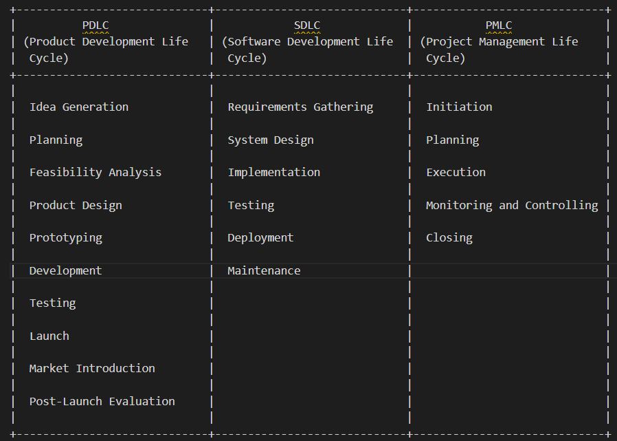
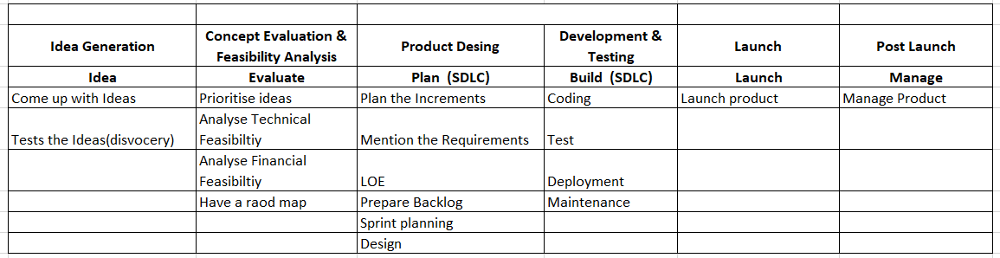

The Product Development Life Cycle (PDLC) is a framework used to guide the process of developing and delivering products or services. While it's commonly associated with product-focused companies, it's not exclusively limited to them. PDLC principles and methodologies can be applied across various industries and sectors, including both product and service-oriented organizations.

### PDLC relating to Agile
- **PDLC as a Framework**: PDLC provides a structured approach to product development, encompassing stages such as ideation, planning, design, development, testing, deployment, and maintenance. It serves as a guiding framework for managing the entire lifecycle of a product or service.

- **Agile as a Methodology**: Agile is an iterative and incremental approach to software development that emphasizes flexibility, collaboration, and customer feedback. It's one of the methodologies that can be used within the broader PDLC framework, particularly in software and technology-focused organizations.

- **Agile within PDLC**: In organizations adopting Agile practices, Agile methodologies such as Scrum, Kanban, or Extreme Programming (XP) are often used as part of the PDLC process. Agile methodologies provide specific practices and techniques for managing product development activities within the broader PDLC framework.

- **Agile and Iterative Development**: Agile methodologies align well with the iterative and incremental nature of PDLC, allowing teams to deliver value to customers more frequently, adapt to changing requirements, and continuously improve product quality.

- **PDLC as a Superset**: PDLC encompasses various approaches to product development, including both Agile and non-Agile methodologies. While Agile is a popular choice within PDLC, organizations may also use other methodologies such as Waterfall or Lean, depending on their specific needs, industry requirements, and organizational culture.

**Key Differences between PDLC, SDLC and PMLC**
- **PDLC** is focused on the end-to-end development of a product, from idea to market launch and beyond.
- **SDLC** is a subset of PDLC when the product in question is software, focusing specifically on software development stages.
- **PMLC** encompasses the management aspects of projects, ensuring that the projects (which can be part of PDLC or SDLC) are completed successfully on time and within budget.

**Challenges** occur when PDLC practices are not rigorous, scalable, or consistent. Organizations may face:
- Delays in delivering the product roadmap
- Inefficiencies in development (including hidden work)
- Reduced effectiveness of R&D spending

Establish a standard PDLC, improve our say/do ratio(Commitment to completion), and train teams to follow the best practices for consistent and impactful results.

**PDLC, SDLC, and PMLC breakdown of each phase and its components**

<table><thead><tr><th>PDLC Phase</th><th>Components</th><th>SDLC Phase</th><th>Components</th><th>PMLC Phase</th><th>Components</th></tr></thead><tbody><tr><td>Idea Generation</td><td>- Market Research</td><td>Requirement Analysis</td><td>- Requirement Analysis</td><td>- Initiation</td><td>- Project Initiation</td></tr><tr><td></td><td>- Brainstorming</td><td></td><td></td><td></td><td></td></tr><tr><td></td><td></td><td></td><td></td><td></td><td></td></tr><tr><td>Concept Development</td><td>- Conceptual Design</td><td>High-Level Design</td><td>- High-Level Design</td><td>- Planning</td><td>- Planning</td></tr><tr><td></td><td>- Feasibility Studies</td><td></td><td></td><td></td><td></td></tr><tr><td></td><td></td><td></td><td></td><td></td><td></td></tr><tr><td>Feasibility Analysis</td><td>- Technical Feasibility</td><td>Detailed Design</td><td>- Detailed Design</td><td>- Execution</td><td>- Execution</td></tr><tr><td></td><td>- Financial Feasibility</td><td></td><td></td><td></td><td></td></tr><tr><td></td><td></td><td></td><td></td><td></td><td></td></tr><tr><td>Product Design</td><td>- Detailed Design</td><td>Implementation</td><td>- Coding</td><td>- Monitoring and Control</td><td>- Monitoring and Control</td></tr><tr><td></td><td>- Prototyping</td><td></td><td></td><td></td><td></td></tr><tr><td></td><td></td><td></td><td></td><td></td><td></td></tr><tr><td>Development</td><td>- Building the Product</td><td>Testing</td><td>- Unit Testing</td><td>- Closure</td><td>- Closure</td></tr><tr><td></td><td></td><td></td><td></td><td></td><td></td></tr><tr><td>Testing</td><td>- Beta Testing</td><td>Testing</td><td>- System Testing</td><td></td><td></td></tr><tr><td></td><td>- User Acceptance Test</td><td></td><td></td><td></td><td></td></tr><tr><td></td><td></td><td></td><td></td><td></td><td></td></tr><tr><td>Launch</td><td>- Market Introduction</td><td>Deployment</td><td>- Deployment</td><td></td><td></td></tr><tr><td></td><td>- Sales and Marketing</td><td></td><td></td><td></td><td></td></tr><tr><td></td><td></td><td></td><td></td><td></td><td></td></tr><tr><td>Post-Launch Review</td><td>- Customer Feedback</td><td>Maintenance</td><td>- Support</td><td></td><td></td></tr><tr><td></td><td>- Performance Metrics</td><td></td><td></td><td></td><td></td></tr></tbody></table>

### PDLC Process

#### Quarterly Planning Process**

Regularly review yearly plan and tweak which projects are the most important for the next three months. This short-term plan, made about six weeks before each new quarter, focuses on getting specific development projects done and launched.

**Role**
- Leadership: Defines the overall strategic direction.
- Product Manager: Establishes the broad plan and requirements for the upcoming quarter.
- Development Teams: Offer estimates of effort (LoE sizing) and contribute to planning discussions.
- UX Designer: Creates UX wireframes and contributes insights to the planning process.

**Goals**
- Clear objectives for the quarter are identified and documented as key outcomes.
- All epics planned for the quarter meet the Definition of Ready (DoR).
- All dependencies are identified, assigned ownership, and mapped out.

The following table presents different planning stages, their descriptions, associated outcomes and artifacts, and typical timeframes in a clear tabular format.

<table><thead><tr><th>Planning Stage</th><th>Description</th><th>Outcomes &amp; Artifacts</th><th>Typical Timeframe</th></tr></thead><tbody><tr><td>Annual Roadmap</td><td>Strategic plan to advance product strategy for the upcoming year.</td><td>- Annual roadmap  - Product vision and strategy   - Initiative overviews and business cases  - Higher-level LOE for project prioritization.</td><td>Annually</td></tr><tr><td>Quarterly Planning:</td><td>Reevaluation and potential adjustment of the annual roadmap based on new inputs.</td><td>- Quarterly roadmap  - Updated initiative overviews and business cases  - Higher-level LOE for project prioritization.</td><td>Quarterly</td></tr><tr><td>Increment Planning</td><td>Tactical project plan to execute development projects within a quarter.</td><td>- Increment Plan (scope/timing/cost) with "firm commits"  - Increment goals  - "Skeletal" requirements (Epics meeting DoR)  - Lower-level LOE for operational planning.</td><td>Quarterly</td></tr><tr><td>Sprint</td><td>Tactical plan to achieve a subset of the increment plan over a two-week period.</td><td>- Detailed requirements (tasks/stories and sub-tasks meeting DoR) &amp; designs  - Sprint scope and goals  - Execution-ready LOE.</td><td>2 weeks</td></tr></tbody></table>

### OKRs and Roadmap
**OKR** stands for Objectives and Key Results, a goal-setting framework popularized by Google. It aims to align and track progress towards goals within an organization.

- **Objectives**: These are the qualitative, aspirational goals that you want to achieve. They provide direction and purpose. Objectives should be ambitious, actionable, and inspirational.
    - Example Objective: Improve Customer Satisfaction.

- **Key Results**: These are the quantifiable metrics that indicate progress towards the objective. Key results are measurable and time-bound, providing a clear indication of success.
    - Example Key Results:
        - Increase Net Promoter Score (NPS) from 60 to 70.
        - Reduce average response time to customer inquiries from 24 hours to 12 hours.
        - Achieve a customer retention rate of 90%.

**Examples**
- Objective: Enhance Student Learning Experience
- Key Results:
    - Increase student engagement by 25%.
    - Improve course completion rates by 20%.
    - Achieve an average student satisfaction rating of 4.5 out of 5.

- Objective: Expand Course Offerings and Reach
- Key Results:
    - Launch 10 new courses in high-demand subjects.
    - Increase student enrollment by 30%.
    - Expand market reach to 5 new countries.

**Roadmap** is a strategic plan that outlines specific goals or milestones to be achieved over time. It provides a high-level overview of the steps needed to reach a desired outcome. Roadmaps can be used for product development, project planning, or organizational growth.

**Examples**
- New Course Development (Q3)
    - Objective: Expand course offerings to meet diverse learning needs.
    - Key Results:
        - Launch courses in STEM subjects, humanities, and languages.
        - Increase enrollment in existing courses by 15% through marketing initiatives.
        - Achieve a 90% completion rate for newly launched courses.

- Platform Enhancements (Q3-Q4)
    - Objective: Improve platform performance and user experience.
    - Key Results:
        - Implement a responsive design for mobile devices.
        - Introduce gamification elements to increase student engagement.
        - Conduct user testing and gather feedback for iterative improvements.

- Educator Support and Training (Q4)
    - Objective: Provide resources and training to educators for effective teaching.
    - Key Results:
        - Host webinars and workshops on pedagogical techniques.
        - Launch a certification program for educators.
        - Develop a community platform for educators to collaborate and share resources.

